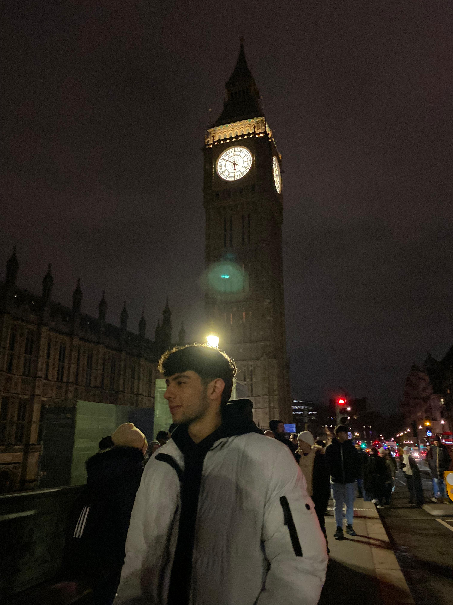

<h2 title="hehehe"> Hola 👋, Soy Ignacio Boghossian!</h2>

 

**Desarrollador FrontEnd**

**About Me!**

- 👨🏽‍💻 Estudiante de Analista Programador Universitario en la UNLP
- 🖥️ Recibido de la carrera de FullStack de CoderHouse
- 💬 Proactivo, responsable y dispuesto a aprender
- 🌱 Aprendiendo Python
- 📫 Contactame! [boghossianignacio@gmail.com](mailto:boghossianignacio@gmail.com).

 

  

 

      